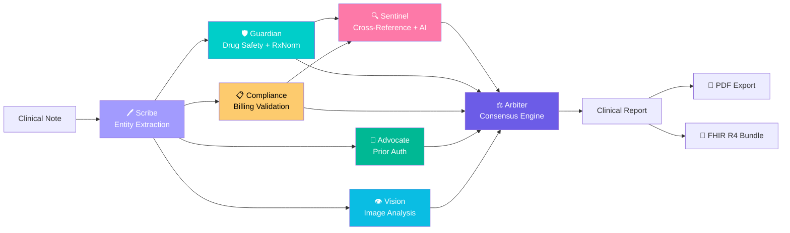

# ⚕ AEGIS — Autonomous Examination Guardian & Intelligence System

**Multi-Agent Clinical Intelligence Platform** for the AMD Developer Hackathon 2026

> 7 specialized AI agents collaborate through mathematical consensus to detect drug interactions, validate diagnoses, ensure billing compliance, and generate prior authorizations — all in under 20 seconds.

[](https://nodejs.org)
[](https://www.amd.com/en/products/accelerators/instinct/mi300x.html)
[](#testing)
[](LICENSE)

---

## 🏗️ Architecture



### Agent Roles

| Agent | Type | Purpose |
|-------|------|---------|
| **Scribe** | LLM | Extracts structured entities (diagnoses, medications, vitals, labs) from free-text clinical notes |
| **Guardian** | Deterministic + API | Drug interactions (local DB + NLM RxNorm API) and allergy cross-reactivity |
| **Compliance** | Deterministic | Validates ICD-10 codes and checks billing rules (specificity, E/M, medical necessity) |
| **Sentinel** | LLM + Deterministic | Cross-references Guardian & Compliance outputs. Detects missed diagnoses, vital abnormalities, red-flag clusters |
| **Advocate** | LLM | Generates prior authorization documents with medical necessity justification |
| **Vision** | LLM | Analyzes medical images (X-rays, CTs, MRIs) with clinical context cross-referencing |
| **Arbiter** | Hybrid | Mathematical consensus engine — weighted voting + Dempster-Shafer evidence accumulation |

### Pipeline Execution Order

```
1. Scribe           → Extract entities (LLM)
2. Clinical Scores  → HEART, qSOFA, NEWS2, CHA₂DS₂-VASc (deterministic, instant)
3. Guardian + Compliance  → Parallel (deterministic + RxNorm API)
4. Sentinel         → After Guardian/Compliance (cross-references their outputs)
5. Advocate + Vision → Parallel if requested (LLM)
6. Arbiter          → Final consensus (math + LLM synthesis)
```

---

## 🧠 Innovation: Mathematical Consensus Engine

Unlike simple LLM chains, AEGIS uses a **mathematically rigorous consensus engine**:

### 1. Weighted Majority Voting
Each agent casts a risk vote weighted by domain expertise:
- Guardian (Safety): weight 1.0
- Sentinel (Clinical): weight 0.95
- Vision (Imaging): weight 0.8
- Sentinel Deterioration Risk: weight 0.7
- Compliance (Billing): weight 0.6

### 2. Dempster-Shafer Evidence Accumulation
Issues detected by multiple agents receive **belief mass scores** that compound:
```
beliefMass = 1 - ∏(1 - mᵢ(A))  for all agents i reporting issue A
```
A drug interaction found by both Guardian AND Sentinel gets a higher belief score than one found by a single agent.

### 3. Inter-Agent Conflict Detection
The Arbiter explicitly identifies disagreements (e.g., Guardian says HIGH risk but Sentinel says LOW) and resolves them through weighted authority.

### 4. Cross-Agent Verification
Sentinel runs **after** Guardian and Compliance, receiving their full reports. This enables genuine cross-referencing — catching cases where drugs pass individual safety checks but create problems in combination with the patient's diagnoses.

### 5. Evidence-Based Clinical Scoring
Deterministic calculators auto-trigger based on extracted conditions:
- **HEART Score** (0-10) — Chest pain risk stratification
- **qSOFA** (0-3) — Sepsis screening
- **NEWS2** (0-20) — National Early Warning Score
- **CHA₂DS₂-VASc** (0-9) — Stroke risk in atrial fibrillation

---

## 📊 Performance Metrics

| Metric | Value |
|--------|-------|
| Pipeline Execution | **~18s** (7 agents) |
| Issue Sensitivity | **100%** (cardiac case) |
| Consensus Confidence | **95%** |
| HEART Score Accuracy | **7/10 (HIGH)** — matches clinical assessment |
| Drug Interactions | **15 local + 100k+ via RxNorm API** |
| ICD-10 Validation | **20+ codes validated** |
| Unit Tests | **37 passing** |
| Sample Cases | **7** (Cardiac, Sepsis, Trauma, Pediatric, Geriatric, Stroke, Psychiatric) |
| Export Formats | **PDF + FHIR R4 Bundle** |

---

## 🚀 Quick Start

### Prerequisites
- Node.js 20+
- Google Gemini API key ([Get one free](https://aistudio.google.com/apikey))

### Setup
```bash
# Clone and install
git clone https://github.com/your-repo/aegis.git
cd aegis
npm install

# Configure
cp .env.example .env
# Edit .env and add your GEMINI_API_KEY

# Start
npm start
# Open http://localhost:3000
```

### Run Tests
```bash
node tests/test_agents.js
# 37 tests: Guardian, Compliance, Clinical Scores, FHIR Export, Edge Cases
```

---

## 🎨 UI Features

- **4 Themes**: Midnight, Cyberpunk, Clinical (light), Aurora
- **Live Agent Network**: Canvas-animated data flow visualization
- **6-Chart Dashboard**: Risk gauge, severity pie, radar, bars, flow, stats
- **Agent Timing Bars**: Per-agent latency breakdown with color-coded performance
- **Arbiter Modal**: Full-screen consensus report with voting bars and evidence scores
- **Clinical Scores Panel**: HEART, qSOFA, NEWS2, CHA₂DS₂-VASc with breakdowns
- **Live Vital Monitor**: SSE-powered real-time vital signs with NEWS2 trending
- **PDF Export**: Downloadable clinical intelligence reports
- **FHIR R4 Export**: HL7-compliant JSON bundle for interoperability
- **Run History**: Persistent JSON-based audit trail
- **7 Sample Cases**: Cardiac, Sepsis, Trauma, Pediatric, Geriatric, Stroke, Psychiatric

---

## 💓 Live Vital Signs Monitor

Real-time vital stream simulation with 4 clinical scenarios:

| Scenario | Demonstrates |
|----------|-------------|
| Sepsis Deterioration | ↑HR, ↓BP, ↑Temp, ↓SpO2 over time |
| Post-MI Monitoring | Cardiac decompensation pattern |
| Recovery from Critical | Improving vitals trend |
| Stable Post-Op | Normal fluctuations baseline |

Each reading auto-calculates the **NEWS2** early warning score and triggers alerts at clinical thresholds (≥3, ≥5, ≥7).

---

## 🔗 Interoperability

### FHIR R4 Bundle Export
Converts pipeline results to HL7 FHIR R4 JSON containing:
- `Patient` resource
- `Condition` resources (diagnoses with ICD-10)
- `MedicationStatement` resources
- `Observation` resources (vitals mapped to LOINC)
- `RiskAssessment` (from Arbiter consensus)
- `AllergyIntolerance` resources

### RxNorm API Integration
Guardian supplements its local drug database with the NLM RxNorm REST API:
1. Resolves drug names → RxCUI identifiers
2. Checks drug-drug interactions via NLM Interaction API
3. De-duplicates against local findings

---

## 🔒 Privacy & HIPAA

- All data processed locally — no PHI sent to external servers except configured LLM
- HIPAA-compliant audit logging to `data/audit.log` with timestamps, IPs, and endpoints
- Security headers: `no-cache`, `no-store`, `HSTS`, `X-Content-Type-Options`
- Clinical disclaimer in application footer (not FDA-cleared, decision support only)
- Configurable for on-premise deployment with local LLMs (vLLM on AMD MI300X)
- PDF reports marked CONFIDENTIAL with PHI notices
- Failed agent disclosure — users warned when consensus is based on partial data

---

## 🔧 AMD Instinct MI300X Deployment

AEGIS is built for AMD Instinct MI300X via vLLM:

```bash
# Switch provider
LLM_PROVIDER=vllm
VLLM_BASE_URL=http://localhost:8000/v1
VLLM_MODEL=meta-llama/Llama-3.1-70B-Instruct

# Deploy with Docker
docker-compose up -d
```

### Why MI300X?
- **192GB HBM3** — Runs 70B models without quantization
- **vLLM optimized** — Continuous batching, PagedAttention
- **HIPAA-ready** — On-premise inference, no data leaves the network

---

## 📁 Project Structure

```
aegis/
├── public/                    # Frontend
│   ├── index.html            # Dashboard, vital monitor, themes, modal
│   ├── styles.css            # 4-theme design system
│   └── app.js                # Canvas charts, agent network, vital stream, exports
├── src/
│   ├── server.js             # Express server + HIPAA audit middleware
│   ├── agents/
│   │   ├── scribe.js         # Entity extraction (LLM) + JSON validation
│   │   ├── guardian.js       # Drug safety (deterministic + RxNorm API)
│   │   ├── compliance.js     # Billing validation (deterministic)
│   │   ├── sentinel.js       # Diagnostic gaps (LLM + deterministic cross-ref)
│   │   ├── advocate.js       # Prior auth (LLM)
│   │   ├── vision.js         # Image analysis (LLM)
│   │   └── clinicalScores.js # HEART, qSOFA, NEWS2, CHA₂DS₂-VASc
│   ├── orchestrator/
│   │   ├── pipeline.js       # Agent coordination with cross-referencing
│   │   └── arbiter.js        # Mathematical consensus (Dempster-Shafer + voting)
│   ├── llm/
│   │   └── provider.js       # Gemini / vLLM abstraction (30s timeout + retry)
│   ├── data/
│   │   ├── drugInteractions.js  # Local drug interaction database
│   │   ├── rxnorm.js         # NLM RxNorm API integration
│   │   ├── fhirExport.js     # FHIR R4 Bundle generator
│   │   ├── billingRules.js   # Billing validation rules
│   │   └── runHistory.js     # Persistent run logging
│   └── routes/
│       ├── agents.js         # REST + SSE API endpoints
│       └── vitals.js         # SSE vital signs stream simulator
├── tests/
│   └── test_agents.js        # 37 unit tests (Guardian, Compliance, FHIR, edge cases)
├── data/
│   ├── audit.log             # HIPAA audit trail
│   └── runs/                 # Pipeline run history (JSON)
├── Dockerfile                # AMD MI300X container
├── docker-compose.yml        # Full stack deployment
└── .env.example             # Configuration template
```

---

## 🧪 Testing

```bash
# Run all 37 tests
node tests/test_agents.js

# Test categories:
#   🛡️  Guardian (8 tests)     — drug interactions, allergies, edge cases
#   📋  Compliance (7 tests)   — ICD-10 validation, billing rules, edge cases
#   🏥  Clinical Scores (5 tests) — HEART, qSOFA, NEWS2
#   🔒  Edge Cases (9 tests)   — empty inputs, unicode, duplicates, large data
#   🔗  FHIR Export (5 tests)  — bundle structure, resources, error handling
#   📦  Module Integrity (3 tests) — RxNorm, Guardian async, FHIR exports
```

---

## 🏆 AMD Developer Hackathon Submission

**Category**: Healthcare AI

**Key Differentiators**:
1. **Mathematical Consensus** — Not just LLM prompting. Weighted voting + Dempster-Shafer evidence theory.
2. **Cross-Agent Verification** — Sentinel cross-references Guardian and Compliance outputs for genuine multi-agent collaboration.
3. **Deterministic Safety** — Drug interactions and billing checks use curated databases + NLM RxNorm API, not AI improvisation.
4. **Evidence-Based Scoring** — Published clinical algorithms (HEART, qSOFA, NEWS2) calculated deterministically.
5. **FHIR Interoperability** — HL7 FHIR R4 bundle export for healthcare system integration.
6. **Live Vital Monitoring** — Real-time vital stream with automatic NEWS2 early warning alerts.
7. **AMD-Ready Architecture** — vLLM provider abstraction for instant MI300X deployment.
8. **Production Quality** — 37 unit tests, run history, PDF/FHIR export, audit trail, HIPAA compliance.

---

## 📜 License

MIT — Built with ❤️ for the AMD Developer Hackathon 2026
